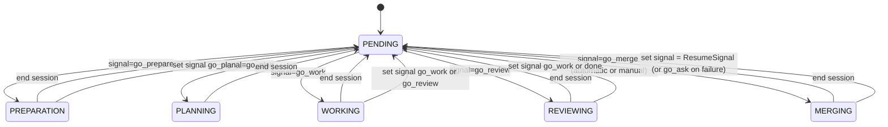

# Task transitions – detailed reference

This document records the complete set of task stage transitions that are
implemented in the repository as of the current commit.  It is intended both as
human documentation and as a checklist for maintainers making changes; the
code paths referenced below are the authoritative source of behaviour.  New
stages or signals must be added consistently across dispatcher logic, the CLI
manager, and the tests.

---

## 0. terminology

- **Stage** – the current location of a task in the state machine.  Stored in
  the task object and persisted by the backends.  See the `Stage` enum in
  `zbobr-dispatcher/src/task.rs`.
- **Signal** – an intent to move a task to a different stage.  Signals are
  carried alongside the task and translated to a target stage by
  `Signal::target_stage()` (also in `zbobr-dispatcher/src/task.rs`).
- **Flavor** – a metadata flag that modifies task behaviour or context without
  changing its stage.  A task can have multiple flavors (stored as
  `HashSet<Flavor>` in the task object).  Currently defined flavors are:
  - `Conflict` – set automatically when merge conflicts are detected,
    indicating the task needs merger intervention.
  - `Stop` – reserved for future use to mark tasks for stopping/cancellation.

Both stages and signals are defined by the dispatcher crate; the CLI and the
MCP servers simply act on them.  Flavors are similarly defined by the dispatcher
and persisted by backends as labels or metadata.

---

## 1. signal → target stage mapping

All conversions from signals to stages are performed by
`Signal::target_stage` (search for its definition in
`zbobr-dispatcher/src/task.rs`).  Changes to this method should also be
reflected in the table below.

| Signal variant | string form | target stage | where it is set |
|---------------|-------------|--------------|-----------------|
| `Stop`        | `stop`      | `PENDING`     | user command (`zbobr task signal stop`), tests |
| `Done`        | `done`      | `PENDING`     | user command, task-completion path in run_role_session |
| `GoAsk`       | `go_ask`    | `PENDING`     | used internally by some helpers, rarely seen |
| `GoPrepare`   | `go_prepare`| `PREPARATION` | initial task creation or user command |
| `GoPlan`      | `go_plan`   | `PLANNING`    | preparator finish, CLI commands      |
| `GoWork`      | `go_work`   | `WORKING`     | CLI, post‑session rules (worker/reviewer/merger) |
| `GoReview`    | `go_review` | `REVIEWING`   | explicit CLI signal or follow-up from worker/merger sessions |
| `GoMerge`     | `go_merge`  | `MERGING`     | dispatcher merge‑conflict logic (see §4)    |

The string forms are used when serialising the signal to JSON / GitHub label
and when parsing command-line input (`FromStr` impl).  A signal is typically
either supplied by the user (via `task signal`), implicitly generated by a
session completion, or produced automatically by the dispatcher as the
result of a condition (see §4 below).

---

## 2. pending‑stage transition logic

The manager loop in `zbobr/src/main.rs` contains the only location where a
`PENDING` task is actually moved to another stage.  On each polling iteration
it calls `list_tasks_by_stage(Stage::Pending, Some(current_tool))` and then,
for each task, looks at `task.signal`.  If the signal’s `target_role()` returns
Some(role), the task runs a session for that role immediately.

This means that:

1. A task does not move until both (a) it is in `PENDING` and (b) its signal
   has been set to a role-triggering signal.
2. Signals take effect immediately when the manager loop finds them; there
   is no separate transition step.

Conditions that set the signal are therefore the primary mechanism for driving
state changes; the manual commands (`task signal …`) and automatic code paths
are described elsewhere in this document.

---

## 3. active stages and follow‑up signals

The five non‑`PENDING` stages are *active* session stages.  When a role session
is started, the task's stage is set to match the role. The task remains in that
stage until the external tool completes or is interrupted.

Upon normal completion, the session code examines the checklist and computes
the next signal based on these rules:

```rust
let stage = match role {
    Role::Preparator => Stage::Preparation,
    Role::Planner    => Stage::Planning,
    Role::Worker     => Stage::Working,
    Role::Reviewer   => Stage::Reviewing,
    Role::Merger     => Stage::Merging,
};
zbobr.set_task_stage(task_id, stage).await?;
```

The task remains in that stage until the external tool completes or is interrupted.

Upon normal completion, the session code examines the checklist and computes
the next signal based on these rules:

| role       | follow-up signal rule (see table in §4) |
|------------|------------------------------------------|
| preparator | always `go_plan`                          |
| planner    | none (planner does not set a signal)      |
| worker     | `go_work` if any checklist item unchecked, otherwise `go_review` |
| reviewer   | `go_work` if unchecked item remains, else `done`              |
| merger     | restores `ResumeSignal` (the signal that triggered the interrupted session) on success, or `go_ask` on failure |

The signal is stored; the next time the task returns to `PENDING` the manager
loop will read it and perform the session described in §2.

---

## 4. automatic / conditional transitions

Most signals are created explicitly, but some are generated by internal
conditions. Currently the only such condition is merge conflict detection in
the GitHub backend (`zbobr-dispatcher/src/task.rs`).

When a merge conflict is detected, `Signal::GoMerge` is set automatically,
ensuring the merger role picks up the task on the next iteration.

When a conflict interrupts a session, the original signal (e.g., `go_review`)
is stored in the `ResumeSignal` parameter before clearing the active signal.
After the Merger session completes, this signal is restored, resuming the task
from where it was interrupted. If another conflict occurs, both the signal and
flavor preparation repeat.

Additional conditional signals can be added using this pattern: detect the
condition, call `set_signal()`, and optionally post a message. Remember that
the task must be in `PENDING` for transitions to occur.

---

## 5. task flavors and metadata

Flavors are metadata flags that modify task behaviour or provide context
without changing the task's stage.  Unlike signals which trigger state
transitions, flavors persist on the task and can be used for filtering, logging,
or branching logic.

### 5.1 Conflict flavor

The `Conflict` flavor is automatically set when the GitHub backend detects a
merge conflict. It serves two purposes:

1. **Operational tracking**: Tasks can be filtered by flavor (e.g., `zbobr task list --flavor conflict`) to identify which tasks have unresolved conflicts.
2. **Session cleanup**: When a Merger session completes successfully, the flavor
   is automatically cleared, resetting the task for normal operation.

Flavors are persisted by all backends (GitHub labels, filesystem YAML files).

### 5.2 Stop flavor

The `Stop` flavor is reserved for future use to mark tasks for stopping or
cancellation. Currently defined but not yet utilized in transition logic.

---

## 6. diagrams (Mermaid)



(see `docs/` for rendered output if your Markdown viewer supports Mermaid)

---

## 7. adding or modifying transitions and flavors

Any change to the transition machinery must be coordinated across four
locations:

1. **`zbobr-dispatcher/src/task.rs`** – update the `Stage` or `Signal` enum and
   adjust `Signal::target_stage` and `Signal::target_role`; add tests
   in `zbobr-dispatcher` if needed.
2. **`zbobr/src/main.rs`** – modify the manager loop signal handling and the
   follow‑up signal policy in `run_role_session` if the role should set one.
3. **this document** – update the appropriate table(s) and narrative sections.
4. **integration tests** – add or update tests under `zbobr/tests/` that
   exercise the new transition and verify both the signal and resulting session.

Failing to update any of these places often results in silent no-ops or
inconsistent behaviour.

When adding or modifying **flavors** specifically:

1. **`zbobr-dispatcher/src/task.rs`** – add the new variant to the `Flavor` enum
   and implement its string representation in the `name()` and `FromStr` methods.
2. **Codebase** – identify where the flavor should be set (e.g., in detector
   logic) and where it should be cleared (e.g., in session cleanup).
3. **Persisted metadata** – ensure all backends handle the flavor:
   - **GitHub backend** (`zbobr-task-backend-github/src/github.rs`): update
     `apply_flavor_change()` and label mapping logic to handle the new flavor.
   - **Filesystem backend** (`zbobr-task-backend-fs/src/fs.rs`): ensure
     `TaskFile` serialization/deserialization includes the flavor.
4. **Tests** – add tests that verify flavor presence/absence at appropriate
   stages and that flavor-based filtering works correctly.
5. **Documentation** – add a section documenting the flavor's purpose, triggers,
   and lifecycle in this document.

Flavors are typically used for cross-cutting concerns (e.g., conflict
resolution, cancellation) that don't fit neatly into a task's linear stage
progression.


---

*Document last updated: 24 Feb 2026.*
