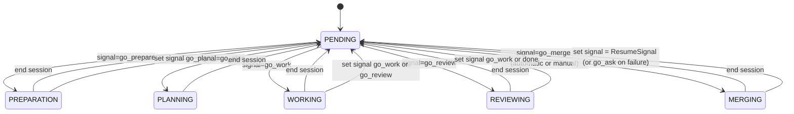

# Task transitions – detailed reference

This document records the complete set of task stage transitions that are
implemented in the repository as of the current commit.  It is intended both as
human documentation and as a checklist for maintainers making changes; the
code paths referenced below are the authoritative source of behaviour.  New
stages or signals must be added consistently across dispatcher logic, the CLI
manager, and the tests.

---

## 0. terminology

- **Stage** – the current location of a task in the state machine.  Stored in
  the task object and persisted by the backends.  See the `Stage` enum in
  `zbobr-dispatcher/src/task.rs`.
- **Signal** – an intent to move a task to a different stage.  Signals are
  carried alongside the task and translated to a target stage by
  `Signal::target_stage()` (also in `zbobr-dispatcher/src/task.rs`).

Both stages and signals are defined by the dispatcher crate; the CLI and the
MCP servers simply act on them.

---

## 1. signal → target stage mapping

All conversions from signals to stages are performed by
`Signal::target_stage` (search for its definition in
`zbobr-dispatcher/src/task.rs`).  Changes to this method should also be
reflected in the table below.

| Signal variant | string form | target stage | where it is set |
|---------------|-------------|--------------|-----------------|
| `Stop`        | `stop`      | `PENDING`     | user command (`zbobr task signal stop`), tests |
| `Done`        | `done`      | `PENDING`     | user command, task-completion path in run_role_session |
| `GoAsk`       | `go_ask`    | `PENDING`     | used internally by some helpers, rarely seen |
| `GoPrepare`   | `go_prepare`| `PREPARATION` | initial task creation or user command |
| `GoPlan`      | `go_plan`   | `PLANNING`    | preparator finish, CLI commands      |
| `GoWork`      | `go_work`   | `WORKING`     | CLI, post‑session rules (worker/reviewer/merger) |
| `GoReview`    | `go_review` | `REVIEWING`   | explicit CLI signal or follow-up from worker/merger sessions |
| `GoMerge`     | `go_merge`  | `MERGING`     | dispatcher merge‑conflict logic (see §4)    |

The string forms are used when serialising the signal to JSON / GitHub label
and when parsing command-line input (`FromStr` impl).  A signal is typically
either supplied by the user (via `task signal`), implicitly generated by a
session completion, or produced automatically by the dispatcher as the
result of a condition (see §4 below).

---

## 2. pending‑stage transition logic

The manager loop in `zbobr/src/main.rs` contains the only location where a
`PENDING` task is actually moved to another stage.  On each polling iteration
it calls `list_tasks_by_stage(Stage::Pending, Some(current_tool))` and then,
for each task, looks at `task.signal`.  If the signal’s `target_role()` returns
Some(role), the task runs a session for that role immediately.

This means that:

1. A task does not move until both (a) it is in `PENDING` and (b) its signal
   has been set to a role-triggering signal.
2. Signals take effect immediately when the manager loop finds them; there
   is no separate transition step.

Conditions that set the signal are therefore the primary mechanism for driving
state changes; the manual commands (`task signal …`) and automatic code paths
are described elsewhere in this document.

---

## 3. active stages and follow‑up signals

The five non‑`PENDING` stages are *active* session stages.  When a role session
is started, `run_role_session` sets the task’s stage to the corresponding
active stage:

```rust
let stage = match role {
    Role::Preparator => Stage::Preparation,
    Role::Planner    => Stage::Planning,
    Role::Worker     => Stage::Working,
    Role::Reviewer   => Stage::Reviewing,
    Role::Merger     => Stage::Merging,
};
zbobr.set_task_stage(task_id, stage).await?;
```

The task remains in that stage until the external tool (Copilot/Claude/…) has
finished its session or the process is interrupted.  Upon normal completion the
session code fetches the checklist items and computes the “next signal”:

```rust
let stage = match role {
    Role::Preparator => Stage::Preparation,
    Role::Planner    => Stage::Planning,
    Role::Worker     => Stage::Working,
    Role::Reviewer   => Stage::Reviewing,
    Role::Merger     => Stage::Merging,
};
zbobr.set_task_stage(task_id, stage).await?;
```

The task remains in that stage until the external tool (Copilot/Claude/…) has
finished its session or the process is interrupted.  Upon normal completion the
session code fetches the checklist items and computes the “next signal”:

```rust
let has_unchecked = items.iter().any(|i| !i.checked);
let next_signal = match role {
    Role::Preparator => Signal::GoPlan,
    Role::Worker     => if has_unchecked { Signal::GoWork } else { Signal::GoReview },
    Role::Reviewer   => if has_unchecked { Signal::GoWork } else { Signal::Done },
    Role::Merger     => Signal::GoWork,
    _                => Signal::GoAsk, // unused
};
if matches!(role, Role::Preparator | Role::Worker | Role::Reviewer | Role::Merger)
   && let Err(e) = session.set_signal(next_signal).await { … }
```

| role       | follow-up signal rule (see table in §4) |
|------------|------------------------------------------|
| preparator | always `go_plan`                          |
| planner    | none (planner does not set a signal)      |
| worker     | `go_work` if any checklist item unchecked, otherwise `go_review` |
| reviewer   | `go_work` if unchecked item remains, else `done`              |
| merger     | restores `ResumeSignal` (the signal that triggered the interrupted session) on success, or `go_ask` on failure |

The signal is stored; the next time the task returns to `PENDING` the manager
loop will read it and perform the session described in §2.

---

## 4. automatic / conditional transitions

Most signals are created explicitly, but a small number are generated by
internal conditions rather than by a human command.  Currently the only such
condition is merge conflict detection in the GitHub backend.  The relevant
code is in `zbobr-dispatcher/src/task.rs` (method `TaskBackendGitHub::auto_merge`):

```rust
// after attempting an automatic `git merge` …
if has_conflicts {
    // keep working tree in conflicted state
    let _ = self.post_message(...).await;
    // key step: signal the merger agent
    let _ = self.set_signal(Signal::GoMerge).await;
    tracing::info!("Merge conflict detected for task #{}, signaling GoMerge", ...);
}
```

The effect is to ensure that tasks with unresolved merge conflicts are picked
up by the merger role.  The same signal → session mechanism described in §2
applies, so the task will run a merger session on the next manager iteration.

When a conflict interrupts a session, the coordinator stores the original
signal (e.g. `go_review`) in the `ResumeSignal` task parameter **before**
clearing the active signal.  This is done in `run_role_session` in
`zbobr/src/main.rs`:

```rust
// Don't overwrite ResumeSignal if we are starting a Merger session (signal is GoMerge)
// because ResumeSignal already contains the signal of the interrupted task.
if signal != Signal::GoMerge {
    set_parameter(Parameter::ResumeSignal, Some(signal.to_string()));
}
```

When the Merger session finishes, `run_role_session` reads `ResumeSignal` and
sets it back as the active signal, effectively resuming the task from where it
was interrupted:

```rust
// Merger: restore the interrupted signal from ResumeSignal, or go_ask on failure
if let Ok(Some(sig_str)) = session.get_parameter(Parameter::ResumeSignal).await {
    if let Ok(sig) = sig_str.parse::<Signal>() {
        if has_unchecked { Signal::GoAsk } else { sig }
    } else { Signal::GoAsk }
} else {
    Signal::GoWork  // fallback
}
```

After the signal is restored the `ResumeSignal` parameter is cleared (unless
the task is transitioning to `GoMerge` again, which would indicate another
conflict round).

Integration tests in `zbobr/tests/merging.rs` exercise this path by creating a
repo, inducing a conflict, running a Reviewer session that triggers `GoMerge`,
then running a Merger session, and verifying that the signal is restored to
`go_review`.

Additional conditional signals can be added using the same pattern: detect the
condition in dispatcher code, call `set_signal(...)`, and optionally post a
message or take other side effects.  Remember that the task must also be in
`PENDING` for the transition to occur; if the condition arises while the task
is active it will take effect later.

---

## 5. diagrams (Mermaid)



(see `docs/` for rendered output if your Markdown viewer supports Mermaid)

---

## 6. adding or modifying transitions

Any change to the transition machinery must be coordinated across four
locations:

1. **`zbobr-dispatcher/src/task.rs`** – update the `Stage` or `Signal` enum and
   adjust `Signal::target_stage` and `Signal::target_role`; add tests
   in `zbobr-dispatcher` if needed.
2. **`zbobr/src/main.rs`** – modify the manager loop signal handling and the
   follow‑up signal policy in `run_role_session` if the role should set one.
3. **this document** – update the appropriate table(s) and narrative sections.
4. **integration tests** – add or update tests under `zbobr/tests/` that
   exercise the new transition and verify both the signal and resulting session.

Failing to update any of these places often results in silent no-ops or
inconsistent behaviour.


---

*Document last updated: 24 Feb 2026.*
